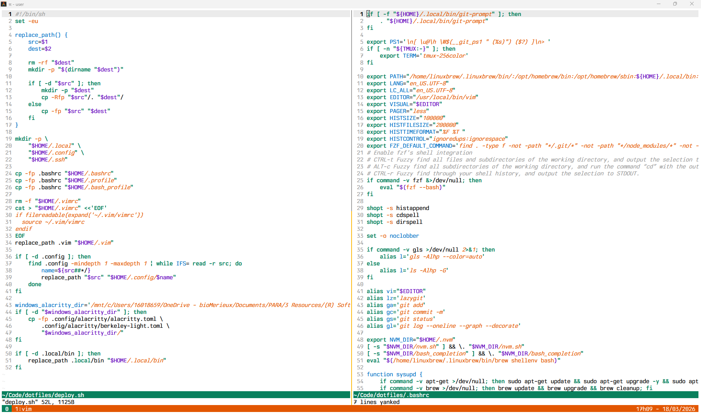

We use Homebrew because `apt` is either outdated (`fzf`) or does not provide some packages (`lazygit`, `lazydocker`).

```sh
/bin/bash -c "$(curl -fsSL https://raw.githubusercontent.com/Homebrew/install/HEAD/install.sh)"
brew install vim tmux fzf lazygit lazydocker tree ripgrep fd
```

Run `deploy.sh` to install the dotfiles. **It overwrites the target files and directories.**

## Berkeley Light theme

Inspired by the Berkeley color scheme for Anvil by 非公開:
https://anvil-editor.net/themes/

Core colors:
- background: white `#FFFFFF`
- foreground: black `#000000`
- muted: gray `#9A9A9A`
- green `#0A805D`
- orange `#E25600`
- gold `#FEB908`
- red `#B73A34`
- purple `#5F00B9`
- blue `#006EC3`

Design principles:
1. Keep the palette small. Use a background, a foreground, an optional muted neutral, and 4 to 5 accent colors.
2. Keep contrast high. Aim for at least WCAG AA (`4.5:1`) for text and background pairs when the theme controls both colors.

## Mirage Raceway theme

Mirage Raceway keeps the Berkeley accent colors but reduces the working palette to six colors. The goal is a matte, muted, paper-like theme with minimal chrome and strong text contrast. It should avoid pure white and pure black, avoid large decorative color blocks, and rely on whitespace, thin separators, and typography for structure.

Typography is part of the theme. Use font styling and weight deliberately:
- regular for default text
- oblique for secondary, contextual, or de-emphasized text
- bold for focus, headings, and strong status emphasis

Palette:
- white `#F7F4EE`
- black `#1E1B18`
- green `#0A7F5D`
- blue `#006EC3`
- orange `#CB3F00`
- red `#B73A34`

Design principles:
1. Use only these six colors.
2. Prefer paper/ink contrast over decorative fills.
3. Use accent colors semantically and sparingly.
4. Prefer bold and oblique before adding more visual noise.
5. Keep statuslines and UI chrome minimal, with separation by line rather than solid blocks where possible.
